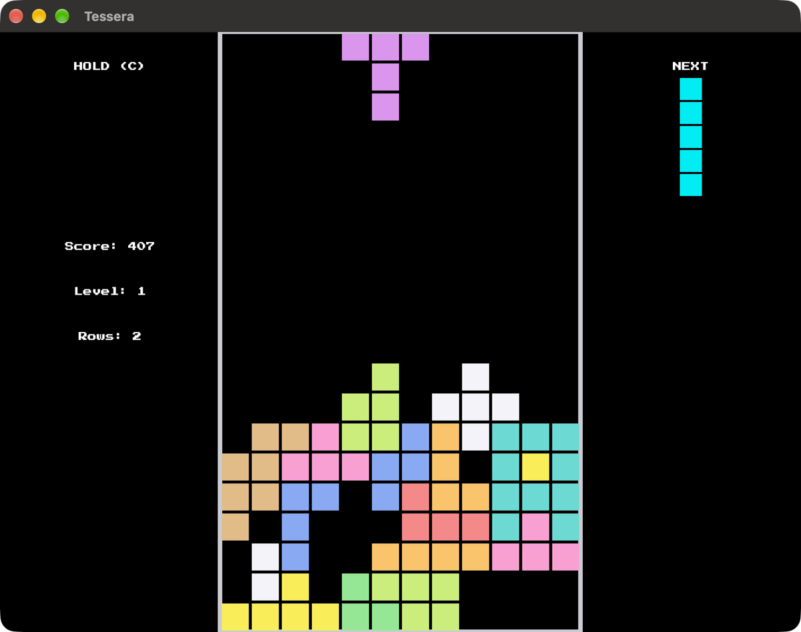

# tessera

Tessera built on [blitzkit](https://github.com/jvalol/blitzkit), the third game
on that engine after pong and snake.

## The project

Part of [blitzkit](https://github.com/jvalol/blitzkit), a graphics engine in
Rust and the games built on it: [pong](https://github.com/jvalol/pong),
[snake](https://github.com/jvalol/snake),
[tessera](https://github.com/jvalol/tessera),
[marble](https://github.com/jvalol/marble) and
[slider](https://github.com/jvalol/slider).

---

I asked AI to draft this for me. I've edited it. Any surviving AI smells are my oversight.
